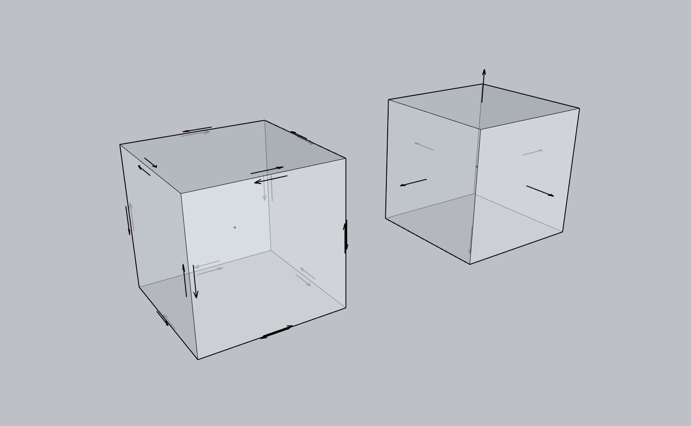
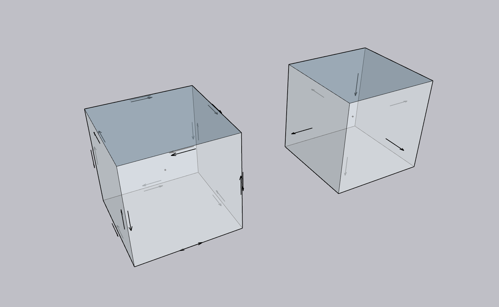

# NGSC Topology Questions

Date: 17 April 2026

The following questions and comments were provided by Landgate (via Colin Stewart) on 15 April 2026.
They reference the set of potential [NGSC Topology Rules](https://github.com/surroundaustralia/topo-feature/blob/master/proposals/topology_rules.md#3d-csdm-topology-rules-test-oriented-summary) discussed with Landgate and Accenture on 8 April 2026.

Surround's detailed response is tabulated below. First, a summary outlining the main points is provided.

## Summary

The main outcome of this review is that the topology rules should be read as practical quality checks for cadastral geometry, not just as abstract software tests. 
In simple terms, one real-world boundary corner should normally be represented by one authoritative point in the dataset. 
Different uses, labels, or histories can still be recorded, but they should be attached to the same geometry rather than by creating duplicate points in the same place. 
The same principle applies more broadly to shared lines, faces, and other common boundaries. 
The discussion below recommends that tolerances should reflect operational cadastral practice, not just very small mathematical defaults.

A second key message is that not every rule applies to every kind of geometry. 
Some tests are intended only for parcel or solid boundaries, while other geometry in a 3D CSDM file may be present for context, observation, terrain, or transition from 2D to 3D. 
For example, terrain triangles, observed vectors, and other non-boundary geometry should not automatically fail rules that are about closed parcel solids. 
The responses therefore narrow several rules, so they apply only where that is intended.

The responses also clarify how parcel relationships should work in practice. 
Primary parcels of the same type should not overlap where they represent exclusive rights, while secondary parcels or interests may overlap and may extend across more than one lot. 
In those cases, the preferred approach is usually to split the geometry at parcel boundaries, or to relate it to a higher-level aggregate where that better reflects the legal structure. 
The same approach also helps with strata cases, party walls, easements, and the gradual build-up from 2D and 2.5D data to full 3D data.

Overall, the responses aim to make the rules easier to apply, easier to explain, and more aligned with real cadastral operations. 
They confirm that orientation and topology do matter where a true 3D solid is being modelled, because they support reliable area, volume, and boundary interpretation. 
At the same time, the responses recognise that some checks are implementation choices rather than strict model requirements, and that additional examples and unit tests will be provided to show how the rules should work in practice.

## 3D CSDM Topology Rules: Test-Oriented Summary
| ID  | Question / Comment                                                                                                                                                                                                                                                   | Response                                                                                                                                                                                                                                                                                                                                                                                                                                                                                                                                                                                                                                                                                                                                                                                                                                                                                                                                                                                                                                                                                                                                                                                                                                                                                                                                                                                                                                                                                                                                                                                                                                                                                                                                                                                                                                                                                                                                                                                                                                                                                                                                                                                                                                                                                                                                                                                                                                                                                                                                                                                                                                                                                                                                                                                                                                                                                                                                                                                                                                                                                                                    |
|-----|----------------------------------------------------------------------------------------------------------------------------------------------------------------------------------------------------------------------------------------------------------------------|-----------------------------------------------------------------------------------------------------------------------------------------------------------------------------------------------------------------------------------------------------------------------------------------------------------------------------------------------------------------------------------------------------------------------------------------------------------------------------------------------------------------------------------------------------------------------------------------------------------------------------------------------------------------------------------------------------------------------------------------------------------------------------------------------------------------------------------------------------------------------------------------------------------------------------------------------------------------------------------------------------------------------------------------------------------------------------------------------------------------------------------------------------------------------------------------------------------------------------------------------------------------------------------------------------------------------------------------------------------------------------------------------------------------------------------------------------------------------------------------------------------------------------------------------------------------------------------------------------------------------------------------------------------------------------------------------------------------------------------------------------------------------------------------------------------------------------------------------------------------------------------------------------------------------------------------------------------------------------------------------------------------------------------------------------------------------------------------------------------------------------------------------------------------------------------------------------------------------------------------------------------------------------------------------------------------------------------------------------------------------------------------------------------------------------------------------------------------------------------------------------------------------------------------------------------------------------------------------------------------------------------------------------------------------------------------------------------------------------------------------------------------------------------------------------------------------------------------------------------------------------------------------------------------------------------------------------------------------------------------------------------------------------------------------------------------------------------------------------------------------------|
| 1   | Can we clarify if a ‘unique’ point (line/poly/face) is geometry based or is a ‘unique’ value if another attribute is different. After reading TR-01, we understand sub-millimetre geometry, but by rule can two points exist at the same point with different usage? | **Unique cadastral points No duplicate points within tolerance**  For TR-01, _unique_ should be interpreted as geometry- and topology-based, not attribute-based. The test asks whether the dataset contains more than one authoritative point geometry for the same corner position within the adopted tolerance. If two point records fall within that tolerance and relate to the same boundary topology, they should normally resolve to one authoritative point geometry, not two coincident point geometries that differ only by attributes. In the 3D CSDM, a Survey Point carries the point geometry, while name, provenance, and purpose are modelled separately; a Survey Point may relate to a boundary corner, a cadastral mark, a geodetic reference mark, or an occupation mark.  The system should therefore distinguish between the point geometry, the physical mark/monument, and the role played by that point in the cadastre. In the 3D CSDM, a Survey Mark is a physically located object that defines a point on the Earth and references a physical monument description, while purpose is a separate property with cardinality [1..*]. The model even notes that the same identified object may have different types in different CSDs. In practical terms, that means one geometry or mark may legitimately have multiple roles, but those roles should be expressed through purpose, classification, provenance, or relationships, not by creating duplicate coincident point primitives.  From a cadastral perspective, a boundary corner should therefore be represented by one authoritative boundary point/mark. There should not be multiple boundary marks within the operational minimum distance, and there should not be multiple point primitives tied to the same boundary lines to define the same corner. Allowing duplicate primitives introduces referential ambiguity: later edits may move one point and not the other, causing shared boundaries and dependent features to diverge. This is consistent with the broader 3D CSDM geometry pattern, which supports reuse of shared geometry rather than duplication.  The sub-millimetre tolerance in TR-01 is best treated as a computational default, not necessarily as the operational cadastral tolerance. For cadastral validation, the adopted tolerance should usually reflect the smallest meaningful separation between distinct survey marks for the domain and workflow, while still being large enough to absorb rounding and numerical noise ([see discussion relating to tolerances below](#implemented-rules--detail)). If needed, the rule can be profiled more narrowly, for example: all boundary marks must be geometrically unique within X metres.  We shall provide a unit test to demonstrate the unique cadastral point test.                                                                                                                                                                                                                               |
| 4   | Can we please see an example. Is this a restriction of 0.003m line lengths?                                                                                                                                                                                          | **Minimum curve length Curves must exceed minimum length tolerance**  TR-12, as described, sets a minimum allowable curve length of 0.003 m. As with TR-01, this tolerance should be set to a value that is operationally sensible. For example, if the TR-01 tolerance is set to 0.10 m, there is little value in setting the TR-12 tolerance to anything smaller than 0.10 m, because curves below that length would already fall below the practical geometric tolerance of the dataset.  We shall provide a unit test to demonstrate the minimum length test ([see discussion relating to tolerances below](#implemented-rules--detail)).                                                                                                                                                                                                                                                                                                                                                                                                                                                                                                                                                                                                                                                                                                                                                                                                                                                                                                                                                                                                                                                                                                                                                                                                                                                                                                                                                                                                                                                                                                                                                                                                                                                                                                                                                                                                                                                                                                                                                                                                                                                                                                                                                                                                                                                                                                                                                                                                                                                           |
| 8   | Can we have this expanded? We cannot have in in DBm but is a 3dcsm file? For example having abuttal  HWM lines as an example. Should it be -  no dangling curves – for solid boundary                                                                                | **No dangling curves Curves must form boundaries or be explicitly flagged**  Yes, it is clearer to say _no dangling curves in the polygon parcel or solid boundary topology_ rather than _no dangling curves_ generally. A 3D CSDM file can contain lines that are informative or observed but not part of a parcel polygon or solid shell. TR-03 should only fail when a curve that is intended to define a boundary face or shell is left orphaned.  We have revised TR-03 to make this clearer.  We need to confirm which terms from `wa-vector-purpose` need to be used to restrict curve selection.                                                                                                                                                                                                                                                                                                                                                                                                                                                                                                                                                                                                                                                                                                                                                                                                                                                                                                                                                                                                                                                                                                                                                                                                                                                                                                                                                                                                                                                                                                                                                                                                                                                                                                                                                                                                                                                                                                                                                                                                                                                                                                                                                                                                                                                                                                                                                                                                                                                                                        |
| 12  | Need to clarify void                                                                                                                                                                                                                                                 | **Connected interior Surface interior must be continuous**  Given the rule and description for item 12 and the description for the test TR-23 the term void is ambiguous. Do you mean a **hole** in a _surface_ (that is, an interior ring in a polygon or surface) or do you mean a **void** in a _solid_ (that is, an internal cavity bounded by interior shells).  In the context of rule 12, TR-23 is about the validity of a surface ring, not about whether a solid may contain an internal cavity. A hole in a surface is a valid geometric concept and is normally represented by an interior ring. A void in a solid is different. It is an enclosed internal cavity bounded by interior shells. TR-23 should therefore be read as checking that each individual surface ring, whether exterior or interior, is topologically well-formed and does not pinch or split the surface interior by repeating a vertex. It should not be read as prohibiting either a legitimate surface hole or a legitimate solid void.                                                                                                                                                                                                                                                                                                                                                                                                                                                                                                                                                                                                                                                                                                                                                                                                                                                                                                                                                                                                                                                                                                                                                                                                                                                                                                                                                                                                                                                                                                                                                                                                                                                                                                                                                                                                                                                                                                                                                                                                                                                                            |
| 15  | Please clarify with an example                                                                                                                                                                                                                                       | **Shared edges consistency Adjacent surfaces must use opposite edge orientations**  The rule is not about the absolute direction of the curve itself. It is about how the same shared curve is used by two adjacent surfaces. If **Surface 1** uses the shared edge as `P1 → P2`, then **Surface 2** should use that same edge as `P2 → P1`. If both surfaces use `P1 → P2`, they are using the edge with the same orientation, which indicates that the surface orientation is inconsistent across the shared boundary. In solid modelling terms, that breaks the outward-normal convention on the shared edge.  _Correct shared-edge orientation_ **Surface A ring**:  `A → B → C → D → A` **Surface B ring**:  `B → A → E → F → B`  _Shared edge_: **Surface A** uses `A → B` **Surface B** uses `B → A`   ✓ opposite orientation  <figure class="fig fig-wide"> <figcaption id="figure-1-correct-winding">Figure 1: Correct Winding of a Solid</figcaption> </figure>  The orientation of the edge arrows are pointing in opposite directions (left cube in Figure 1) and the face normals are pointing out of the solid (right cube in Figure 1).  _Incorrect shared-edge orientation_ **Surface A ring**:  `A → B → C → D → A` **Surface B ring**:  `A → B → E → F → A`  _Shared edge_: **Surface A** uses `A → B` **Surface B** uses `A → B`   ✗ same orientation  <figure class="fig fig-wide"> <figcaption id="figure-2-incorrect-winding">Figure 2: Incorrect Winding of a Solid</figcaption> </figure>  For the edges that are not wound in the correct orientation the the arrows indicating the edge orientation are pointing in the same direction (left cube in Figure 2) and the face normal is pointing into the solid (right cube in Figure 2).  The shared curve must reverse direction between the two adjacent surfaces. Opposite orientation means the two surfaces are consistently oriented. The same orientation means the shared boundary has been assembled incorrectly.                                                                                                                                                                                                                                                                                                                                                                                                                                                                                                                                                                                                                                                                                                                                                                                     |
| 16  | Please clarify – is this the define direction of surface (+/-), and must be square?                                                                                                                                                                                  | We have assumed this question refers to Rule 15 and TR-05  **Shared edges consistency Adjacent surfaces must use opposite edge orientations**  This rule is about orientation, not shape. The `+` and `−` signs do not mean the surface must be square. They indicate the direction in which the shared curve is used by each surface. In the 3D CSDM, boundary edges and faces are explicitly orientable, and the _as created_ or _inner_ and _outer_ features can be swapped by inverting the orientation of the underlying geometry primitive.  As described above, where two surfaces share the same edge, one surface should use that edge in one direction and the other surface should use it in the opposite direction. This is consistent with the ISO and OGC surface models, which state that when two polygons share a common boundary, they traverse that shared segment in opposite directions.  We have clarified the wording of TR-05 to improve understanding.                                                                                                                                                                                                                                                                                                                                                                                                                                                                                                                                                                                                                                                                                                                                                                                                                                                                                                                                                                                                                                                                                                                                                                                                                                                                                                                                                                                                                                                                                                                                                                                                                                                                                                                                                                                                                                                                                                                                                                                                                                                                                                         |
| 19  | How will this work in ‘surface’ shapes, ie dem triangles?                                                                                                                                                                                                            | **No dangling faces Every face must participate in at least one shell**  For ground surfaces such as DEM/TIN triangles, TR-18 would normally not apply. It should apply only to surfaces that are intended to function as boundary faces in a solid shell. A terrain triangle can exist as surface geometry without being an error simply because no solid shell references it.  TR-18 has been revised to clarify that the test does not apply to terrain surfaces not intended to participate in solid geometry.                                                                                                                                                                                                                                                                                                                                                                                                                                                                                                                                                                                                                                                                                                                                                                                                                                                                                                                                                                                                                                                                                                                                                                                                                                                                                                                                                                                                                                                                                                                                                                                                                                                                                                                                                                                                                                                                                                                                                                                                                                                                                                                                                                                                                                                                                                                                                                                                                                                                                                                                                                                      |
| 25  | Can we further explore this rule? Software may require this, but does 3dcsdm care about orientation?                                                                                                                                                                 | **Shell orientation Outer shell outward, inner shells inward**  This rule is worth exploring further. The 3D CSDM does care about orientation at the topological level, because orientation is part of how boundary primitives are interpreted. In the 3D CSDM, a Boundary Face is an orientable surface, the inner and outer features may be swapped by inverting the orientation of the geometry primitive, and a Boundary Feature adds information about the orientation of the geometry relative to topologically connected features. Orientation is therefore part of the meaning of boundary topology, not just a software convenience.  ISO 19107 provides the conceptual basis for boundary-representation solids and describes the boundary of a solid as a set of oriented, closed surfaces. GML carries those concepts into an encoding model by distinguishing exterior and interior boundaries of a solid and by using orientation conventions for surfaces and shells. OGC Simple Features is also a useful reference because it describes polyhedral surfaces as having an inward or outward surface sense even though it doesn't reference solid-shell semantics explicitly.  TR-25 goes one step further by expressing those concepts as a specific software validation test based on signed volume and face winding. That is best understood as an implementation rule for checking whether a closed shell is consistently oriented, rather than as a statement that the 3D CSDM itself mandates this exact formula.  If orientation is ignored, some geometric measures may still be computed, but not all results can be relied on in the same way.  Surface area is usually less sensitive to orientation. For a single valid face, reversing the ring or face direction does not normally change the magnitude of its area. However, orientation becomes more important once holes, shared edges, or stitched surfaces are involved, because it helps determine which boundary is exterior, which are interior, and how adjoining surfaces relate to one another within a shell. So following ISO 19107 and GML approaches results in a more consistent boundary representation.  Solid volume is more sensitive to orientation. A software implementation may still be able to derive a volume magnitude if it first repairs or normalises the shell, but signed-volume methods, outward normal tests, and inside/outside interpretation depend on the shell being oriented consistently. On this basis, orientation is not just a rendering preference; it is part of what makes a solid interpretable as a solid.  More broadly, if orientation is ignored, downstream 3D operations cannot always be trusted to behave correctly. Checks and computations that depend on inward versus outward interpretation, shell assembly, normal direction, shared-face direction, or topological adjacency may become ambiguous or unreliable.  So, practically, correct shell orientation also allows a solids volume to be validated. |
| 27  | How will this interact when we have 3d elements interacting with 2(.5)D elements? Or Freehold land, interacting with Built strata elements (on bdy)? Need to be aware of transitional period as data is built up.                                                    | **Face adjacency limit Face adjacent to at most one neighbour solid**  TR-10 should be read as a rule for fully topological solid boundaries, not as a rule for every interface parcel type that appears in a mixed 2.5D / 3D dataset. In the 3D CSDM, as outlined above, a Boundary Face is defined as the orientable surface where two solids touch, and the shell of a feature may be computed from the set of such faces. That means the rule _each face may be shared by at most two solids_ is really a constraint on the solid topology subset of the data.  Where a 3D built strata element interacts with a 2.5D freehold parcel, the interface may not always be modelled as a shared face between two solids, because one side may not yet be encoded as a solid at all. The 3D CSDM also allows other geometry patterns, including surface footprints, arbitrary application-specific boundary surfaces, extruded geometry, and nominal or truncated boundaries. So in a transitional dataset, the absence of a second solid on the other side of a face should not automatically be treated as a TR-10 failure.   If both sides are modelled as solids, then one shared face between them is valid, and TR-10 simply prevents that same face from being used by three or more solids. But if only the built strata unit is modelled as a true 3D solid and the adjoining freehold land is still represented as a Polygon (on Datum), terrain surface, parcel surface, or other 2.5D approximation, then that interface is better treated as a non-topological or transitional boundary, not as a fully shared solid face.  TR-10 should therefore only to faces that are declared or inferred to be part of a closed solid topology. It should not be used to fail other types of geometries, or nominal boundaries that exist while the cadastre is being progressively upgraded from 2.5D to 3D. The 3D CSDM's example of a truncated boundary face with a nominal solid geometry is helpful here, because it shows that the model already anticipates boundaries that are meaningful without requiring a complete paired-solid representation on both sides.  The wording of TR-10 has been revised to clarify this point.                                                                                                                                                                                                                                                                                                                                                                                                                                                                                                                                                                                                                                                                                                                                                                                                                                      |
| 28  | Can we refer to these rules as no ‘primary’ parcel overlapping, but ‘secondary’ parcels are allowed.                                                                                                                                                                 | **No overlapping solids Solids in same theme cannot overlap (by 3D AABB)**  Rather than saying only _no primary parcel overlapping,_ it is better to say _no overlapping primary parcels of the same type / exclusivity class_. That matches the 3D CSDM model more closely, because the published definition is not a blanket prohibition on every primary parcel intersecting every other parcel; it is specifically about other parcels of the same type. The model also notes that different types of primary parcels may be nested, which means the validator needs to distinguish parcel role/type before deciding whether an overlap is an error.  The TR-08 description and test 28 description have been revised for clarity.                                                                                                                                                                                                                                                                                                                                                                                                                                                                                                                                                                                                                                                                                                                                                                                                                                                                                                                                                                                                                                                                                                                                                                                                                                                                                                                                                                                                                                                                                                                                                                                                                                                                                                                                                                                                                                                                                                                                                                                                                                                                                                                                                                                                                                                                                                                                                                  |
| 29  | Clarify how we will handle Strata components that exist outside the parent lot. e.g., party wall that goes into a neighbouring property.                                                                                                                             | **Parent-child containment Child parcel bbox must lie within parent parcel bbox**  TR-09 should be interpreted against the correct parent spatial unit, not blindly against a single parent lot in every case. In the 3D CSDM, a cadastral parcel may be described by a surface or solid together with topological relationships to other parcels, a Parcel Aggregate may represent the collective extent of multiple parcels as a spatial unit, and a Boundary Face is explicitly a shared orientable surface between touching features. That means a party wall or similar cross-boundary strata component is not necessarily best treated as a child solid of only one parent lot.  For a simple party wall, the practical approach is usually to split it at the parent parcel boundary and assign each part to the relevant parent parcel, or else model the wall as a shared boundary / aggregate object linked to the higher-level subdivision or estate extent rather than to one lot alone. That aligns with the 3D CSDM patterns for shared boundaries and parcel aggregates.  If a strata lot appears to extend into a neighbouring parcel, that usually means one of two things: either the component should be partitioned at the parcel boundary, or the chosen _parent_ is too narrow and the correct parent is the higher-level aggregate / subdivision extent that contains both _parent_ parcels. In that sense, the issue is usually not that a child is allowed to sit outside its parent, but that the model needs the right parent object for the containment test. This is an implementation interpretation based on the parcel, aggregate, and boundary concepts in the 3D CSDM model.  The wording or TR-09 has been revised to help clarify the test.                                                                                                                                                                                                                                                                                                                                                                                                                                                                                                                                                                                                                                                                                                                                                                                                                                                                                                                                                                                                                                                                                                                                                                                                                                                                                                         |
| 30  | We need some examples of this. How do we capture where in interests is over multiple lots (in strata as an example) discuss and explore. Explore edge cases.                                                                                                         | **Easement containment Easements must lie within their servient parcel**  We have amended TR-20 to use `burdened` and `benefitted` rather than `servient` and `dominant` as those are the terms the 3D CSDM uses and Secondary Parcel generally, rather than easement. Where a Secondary Parcel extends across multiple Primary Parcels, the preferred pattern is usually to split the Secondary Parcel geometry at Primary parcel boundaries and validate each Secondary Parcel part against the Primary parcel that is burdened by that part. Where the implementation needs one higher-level object, the affected parcels may instead be grouped through a parcel aggregate / estate parcel, and containment tested against that aggregate extent. The benefitted parcel or parcels are captured as part of the interest relationship, but they are not the parcels used for the containment check.  If a Secondary Parcel affects several strata lots and common property, that is not one parcel with one servient reference. It is one interest that may have multiple burdened parcels and one or more benefitted parcels. The cleanest geometry pattern is usually to partition the Secondary Parcel by burdened parcel and link those parcel parts back to the same interest. That avoids forcing one containment rule onto what is really a many-to-many legal relationship. Since secondary parcels may overlap, the approach also fits the broader parcel model better than treating the easement as one solid that must sit inside one lot only.  The wording or TR-20 has been revised to help clarify the test.  We shall develop a  set of test cases to demonstrate this requirement.                                                                                                                                                                                                                                                                                                                                                                                                                                                                                                                                                                                                                                                                                                                                                                                                                                                                                                                                                                                                                                                                                                                                                                                                                                                                                                                                                                                  |
| X.1 | Can we ensure that we have a rule that ensures that 2(.5)d elements do not overlap and are contiguous. Primary parcels cannot exist in the same space in a 2d space.                                                                                                 | Yes. We can add a corresponding rule for 2D / 2.5D parcel coverage. In the 3D CSDM, a Primary Cadastral Parcel is defined as a parcel that may not overlap with other parcels of the same type because it represents an exclusive right, while Secondary Cadastral Parcels may overlap primary and other secondary parcels. A cadastral parcel may also be represented by a surface rather than a solid, so the same principle can be applied to 2D / 2.5D parcel representations.  For implementation, the overlap part is a standard polygon validation / polygon overlay test. The contiguity part is slightly different. It is really a coverage test, checking that the relevant set of primary parcel surfaces forms a gap-free, non-overlapping partition where that is expected. The polygon rules in the Simple Features model already provide the basic geometric foundation, including connected interiors, no crossing rings, and no cut lines or spikes.   So, yes, the practical approach is to use the same face/polygon tests already defined, but apply them in 2D / 2.5D mode to parcel surfaces or terrain-intersection footprints. In effect, this becomes a rule such as: Primary parcels of the same type must not overlap in 2D, and where they form a subdivision fabric, they must also be contiguous with no unintended gaps or slivers. Secondary parcels would remain exempt from the non-overlap part where the model allows overlap.                                                                                                                                                                                                                                                                                                                                                                                                                                                                                                                                                                                                                                                                                                                                                                                                                                                                                                                                                                                                                                                                                                                                                                                                                                                                                                                                                                                                                                                                                                                                                                                                                                          |

## Implemented Rules — Detail

| ID    | Question/Comment                                                                                               | Response                                                                                                                                                                                                                                                                                                                                                                                                                                                                                                                                                                                                                                                                                                                                                                                                                                                                                                                                                                                                                                                                                                                                                                                                                                                                                                  |
|-------|----------------------------------------------------------------------------------------------------------------|-----------------------------------------------------------------------------------------------------------------------------------------------------------------------------------------------------------------------------------------------------------------------------------------------------------------------------------------------------------------------------------------------------------------------------------------------------------------------------------------------------------------------------------------------------------------------------------------------------------------------------------------------------------------------------------------------------------------------------------------------------------------------------------------------------------------------------------------------------------------------------------------------------------------------------------------------------------------------------------------------------------------------------------------------------------------------------------------------------------------------------------------------------------------------------------------------------------------------------------------------------------------------------------------------------------|
|       | **Point Rules:**                                                                                                 |                                                                                                                                                                                                                                                                                                                                                                                                                                                                                                                                                                                                                                                                                                                                                                                                                                                                                                                                                                                                                                                                                                                                                                                                                                                                                                           |
| TR-01 | do we need to set a higher tolerance? Or is 1e-6. With this tolerance topology rule 1 comment is moot.         | As outlined above, tolerance can be set to a value that is operationally relevant. It is usually better to set the main validation tolerance to reflect the operational reality of the phenomenon and dataset, not just to make the geometry mathematically neat.   One way to think about it is to separate two different tolerances: 1. **Computational tolerance**: This is a very small tolerance used to deal with floating-point noise, coordinate rounding, and implementation artefacts. 2. **Operational or Domain tolerance**: This reflects the real precision, uncertainty, or resolution that is meaningful for the data and workflow.  For most geometry unit tests on real cadastral data, the second one is the more important. If you set the tolerance too small just to make the geometry well defined, you can end up failing valid data because of rounding, survey capture limits, conversion effects, or expected operational variation. If you set it too large, you risk hiding genuine topological or geometric errors.  We recommend using a small computational tolerance only to stabilise the math. But set the validation tolerance to a value that is operationally meaningful for the data, the survey method, and the business purpose. |
| TR-12 | Happy with 1 mm as minimum.                                                                                    | See comment above.                                                                                                                                                                                                                                                                                                                                                                                                                                                                                                                                                                                                                                                                                                                                                                                                                                                                                                                                                                                                                                                                                                                                                                                                                                                                                        |
|       | **Containment Rules:**                                                                                         |                                                                                                                                                                                                                                                                                                                                                                                                                                                                                                                                                                                                                                                                                                                                                                                                                                                                                                                                                                                                                                                                                                                                                                                                                                                                                                           |
|       | We think some confusion should come from the usage of bounding box, should we instead refer to parent extent?  | See the containment discussion (#29) above.                                                                                                                                                                                                                                                                                                                                                                                                                                                                                                                                                                                                                                                                                                                                                                                                                                                                                                                                                                                                                                                                                                                                                                                                                                                               |
| TR-20 | should we refer to as refer to secondary parcels (or interest) rather than easement with servient as primary parcel? | See the easement/Interest containment discussion (#30) above                                                                                                                                                                                                                                                                                                                                                                                                                                                                                                                                                                                                                                                                                                                                                                                                                                                                                                                                                                                                                                                                                                                                                                                                                                              |

## General Notes

### 2D _Liminal_ Parcels

While the 3D CSDM does not explicitly refer to the term _2D liminal parcel_, being a 2D cadastral parcel that sits on the boundary between 2D and 3D cadastral representations ([van Oosterom 2009](https://committee.iso.org/files/live/users/fh/aj/aj/tc211contributor%40iso.org/files/Presentations/2009-11%20Quebec/Oosterom_LADM_Workshop_Quebec.pdf)). 
LADM literature describes the _liminal parcel_ as a parcel used to join 2D parcels with 3D parcels, so that the 2D parcel can be expressed in 3D terms and therefore share a face with a 3D neighbour ([Thompson and van Oosterom 2012](https://www.academia.edu/79690796/Validity_of_mixed_2D_and_3D_cadastral_parcels_in_the_land_administration_domain_model)).

Practically, it is still a 2D boundary, typically stored as a 2D `GM_Curve` or `boundaryFace` string.
But it is interpreted as an open or unbounded 3D column of space, rather than a fully bounded 3D `Solid`.

The 3D CSDM Parcel model includes `zMaxValue` and `zMinValue` properties.
Both are described as an upper/lower extent indicator whose exact interpretation is implementation- and context-dependent. 
The model also includes parcel surface and terrain intersection properties, with the surface described as the terrain or ground level of a parcel and the terrain intersection as the ground-level intersection curve of a 3D parcel. 
That suggests the model can accommodate parcels whose vertical extent is not fully defined, is defined by context, or is represented by surface geometry rather than by a fully closed solid.

The geometry module is similar, but with a qualification. 
A 3D Spatial Unit has `hasGeometry` constrained to an `Abstract Solid Geometry` that supports calculation of interior and surface domains.
So, the core geometry model promotes 3D-solid-capable representations. 
At the same time, the examples include a BoundaryFace marked `geometry:isTruncated true` with an editorial note calling it _an example of a vertically unbounded boundary with a nominal solid geometry._ 
While not identical to LADM’s liminal parcel concept, the model can accommodate vertically unbounded or nominally bounded situations without requiring a fully literal bounded solid.

In practice a 2D parcel is stored as a `Polygon` on Datum. 
The `zMaxValue` and `zMinValue` properties could be defined as `unbounded`.
If a workflow needs a true finite solid for volume tests, clash checks, rendering, or certain topology algorithms, generate a derived proxy solid by clipping the parcel to a chosen volume of interest or jurisdictional envelope.